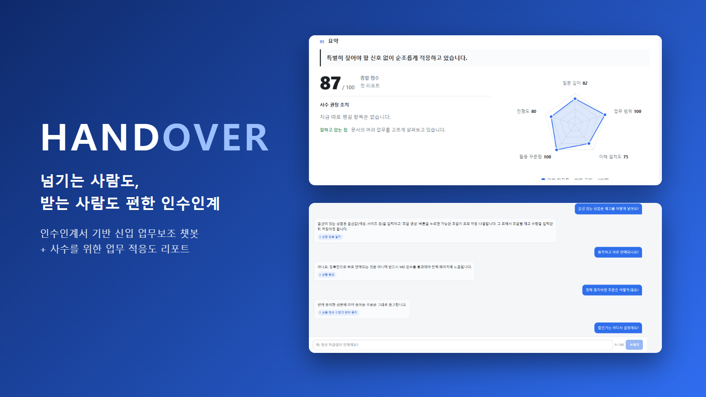
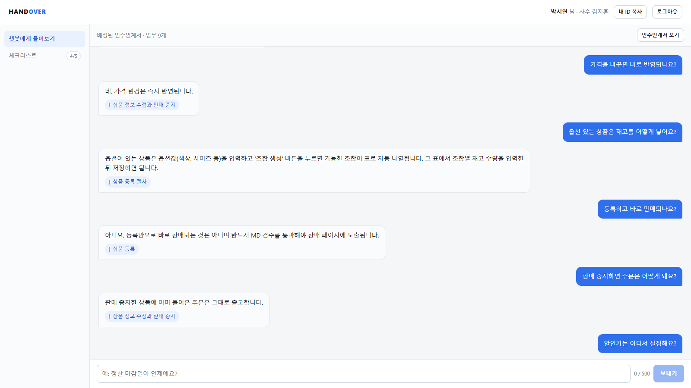
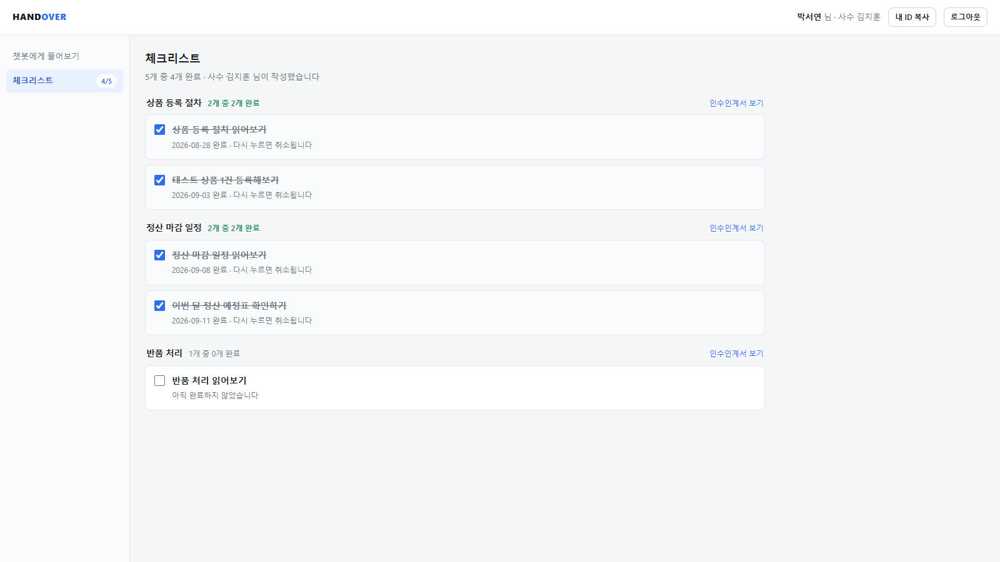
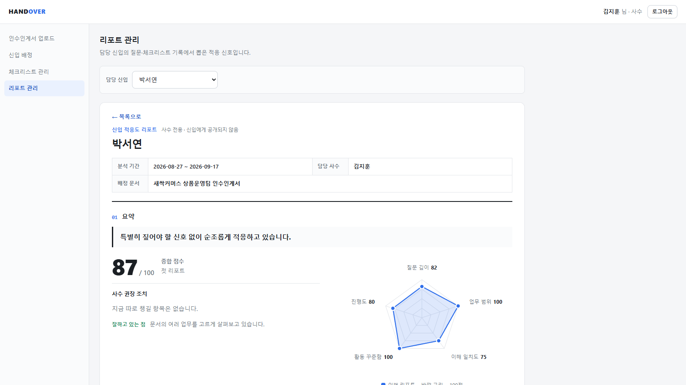
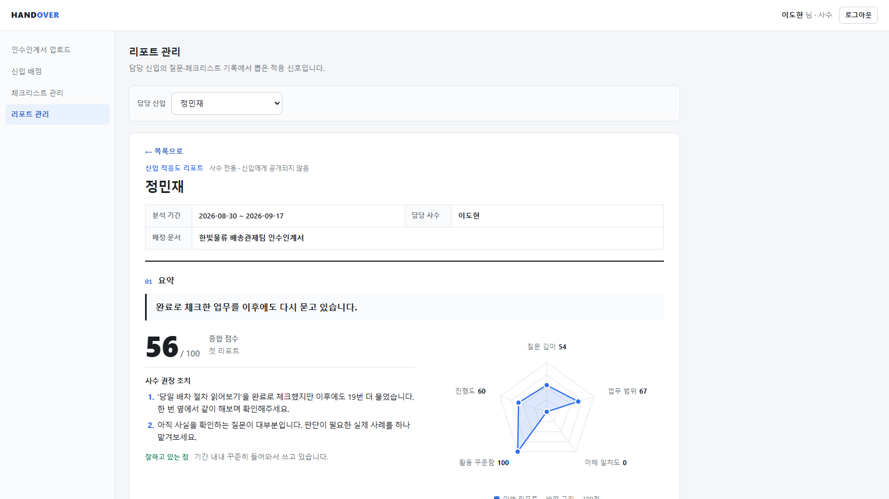
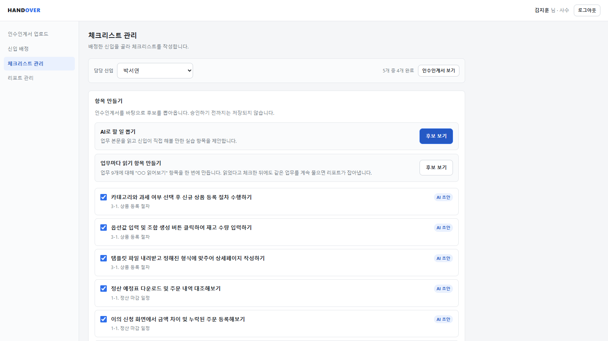
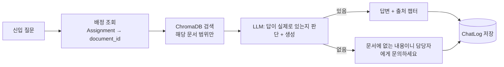
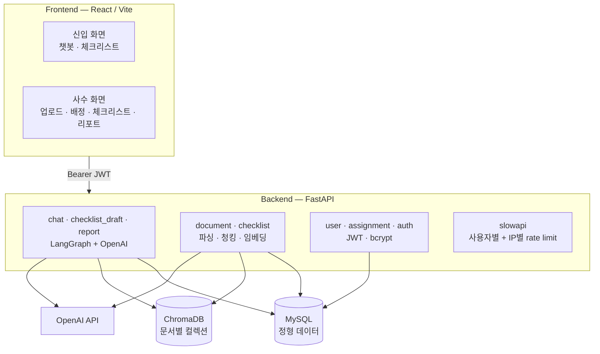

<div align="center">



# HANDOVER

**넘기는 사람도, 받는 사람도 편한 인수인계**

인수인계서를 근거로 답하는 신입 업무보조 챗봇 + 사수를 위한 업무 적응도 리포트

`FastAPI` · `React` · `MySQL` · `ChromaDB` · `OpenAI` · `LangGraph`

</div>

---

## 1. 무엇을 푸는 서비스인가

인수인계서는 넘겨도, **신입이 실제로 이해했는지는 아무도 모릅니다.**

- 신입은 문서를 받고도 같은 질문을 사수에게 반복하고,
- 사수는 체크리스트의 "읽었음" 표시를 믿을 수밖에 없습니다. 자가 체크라 검증할 방법이 없습니다.

> 시장 조사(`docs/시장조사.md`)에서도 인수인계 비용은 신입이 아니라 **사수 쪽**에서 발생했습니다. 신입 1명당 반복 질문으로 시니어의 시간이 약 2.3주 소모되는 사례가 있고, 그 답은 대부분 이미 문서 어딘가에 있습니다.

HANDOVER는 이 문제를 두 방향에서 풉니다.

| 대상 | 제공하는 것 |
|---|---|
| **신입** | 배정된 인수인계서만 근거로 답하는 챗봇 + 체크리스트 |
| **사수** | 신입의 질문·체크리스트 기록에서 뽑은 **적응도 리포트** (신입에게는 노출되지 않음) |

사수가 인수인계서를 올리고 신입 1명에게 배정하면, 신입은 그 문서 범위 안에서 챗봇에게 묻고 체크리스트를 체크합니다. 사수는 그 흔적으로 "누가 어디서 막혔는지"를 면담 없이 봅니다.

---

## 2. 화면

<table>
<tr>
<td width="50%"><b>신입 · 챗봇</b><br>답변마다 출처 업무 태그가 붙습니다.<br></td>
<td width="50%"><b>신입 · 체크리스트</b><br>업무별로 묶여 진행도가 보입니다.<br></td>
</tr>
<tr>
<td><b>사수 · 적응도 리포트 (순조로운 신입)</b><br>종합 점수와 5축 레이더.<br></td>
<td><b>사수 · 적응도 리포트 (주의가 필요한 신입)</b><br>"완료로 체크한 업무를 이후에도 다시 묻고 있습니다."<br></td>
</tr>
<tr>
<td colspan="2"><b>사수 · 체크리스트 관리</b><br>인수인계서에서 AI가 실습 항목 후보를 제안하고, 사수가 골라서 저장합니다.<br></td>
</tr>
</table>

---

## 3. 핵심 기능과 설계

### 3-1. 문서에 없으면 "모른다"고 답하는 RAG 챗봇



- **클라이언트가 보낸 `document_id`를 믿지 않습니다.** `newcomer_id`로 배정을 먼저 조회해 그 신입이 볼 수 있는 문서만 검색합니다. 배정이 없으면 404입니다.
- **"충분히 유사한가"를 거리 임계값이 아니라 LLM 판단으로 처리했습니다.** ChromaDB 기본 거리는 L2라 절대값 기준을 세우기 어렵고, 실측해 보니 정답 청크의 거리(1.46)가 무관한 질문의 거리(1.42)보다 오히려 컸습니다. 숫자 하나로 자르는 방식은 신뢰할 수 없어서, 검색된 텍스트를 실제로 읽는 쪽으로 옮겼습니다.
- **답변 실패 시 "문서를 보강하겠다"는 식의 말을 하지 않습니다.** 그 프레이밍은 사수용 리포트에서만 씁니다.

### 3-2. 체크리스트 "완료"를 검증하는 적응도 리포트

체크리스트 완료는 신입의 자가 체크라 그 자체로는 믿기 어렵습니다. 그래서 **질문 기록과 교차**합니다. 예를 들어 "배차 절차 읽어보기"를 완료하고도 같은 업무를 19번 더 물었다면 이해가 덜 된 신호입니다.

서버가 4개 신호를 계산하고, LLM은 그 결과를 사수가 바로 행동할 수 있는 문장으로 풀어 씁니다.

| 신호 | 보는 것 |
|---|---|
| `growth_curve` | 질문 유형(사실 확인 → 절차 → 판단 → 심화)이 기간별로 어떻게 이동했는지 |
| `chapter_heatmap` | 업무(챕터)별 질문 횟수 |
| `gap_task` | 완료 체크 후에도 같은 업무를 계속 묻는 항목 |
| `silence_risk` | 질문이 급감한 구간 |

- **계산과 서술을 분리했습니다.** 숫자를 LLM이 만들지 않으므로 지어낼 여지가 없습니다.
- **신호마다 "이 숫자가 무엇인지"를 프롬프트에 함께 넘깁니다.** 데모 리포트에서 LLM이 "업무별 질문 12건"을 "12명이 긍정적으로 반응했다"로 잘못 서술하는 걸 발견해서 고친 부분입니다. 신호 이름만 주면 값을 잘못 해석합니다.
- 화면에서는 `silence_risk`를 점수로 쓰지 않고 **활동 꾸준함**(질문했거나 체크리스트를 완료한 날 ÷ 평일의 60%)으로 대체했습니다. 원래 지표는 "질문이 많을수록 좋다"로 읽혀서, 적응해서 질문이 줄어든 신입이 감점되기 때문입니다.

### 3-3. 체크리스트 초안 생성

인수인계서 챕터를 순회하며 신입이 직접 해볼 실습 항목을 LLM이 제안합니다. **저장은 하지 않고 미리보기만 반환**하고, 사수가 골라서 저장합니다(저장·편집은 별도 모듈). 챗봇·초안 생성·리포트 세 흐름은 모두 LangGraph의 `StateGraph`로 단계를 명시적으로 구성했습니다.

---

## 4. 아키텍처



| 영역 | 선택 |
|---|---|
| 백엔드 | FastAPI, SQLAlchemy, Pydantic |
| 정형 DB / 벡터 DB | MySQL / ChromaDB (문서별 컬렉션) |
| LLM | OpenAI `gpt-4o-mini`, 임베딩 `text-embedding-3-small` |
| 다단계 로직 | LangGraph |
| 인증 | JWT(PyJWT) + bcrypt, 모든 API에서 토큰의 `user_id`/`role`과 요청 값을 서버가 대조 |
| 프론트 | React 18, Vite |
| 배포 | Vercel(프론트) + Railway(백엔드, MySQL, 영구 볼륨) |

---

## 5. 엔지니어링 포인트

세 명이 병렬로 개발했고, 저는 **조장**으로 데이터 모델·API 명세·폴더 구조를 먼저 고정한 뒤 AI 파이프라인(챗봇 RAG, 체크리스트 초안, 리포트)과 비용·트래픽 방어, 테스트를 맡았습니다. 아래는 그 과정에서 직접 측정하거나 재현하고 고친 것들입니다.

### 비용 · 트래픽 방어
배포 링크가 심사위원뿐 아니라 투표 참여자에게도 공개되고 이메일 인증이 없어서, LLM 비용이 통제 밖으로 나가지 않게 막았습니다.
- OpenAI를 직접 부르는 3개 API(`/chat/ask`, `/checklist/draft`, `/report/generate`)에 **사용자별 + IP별** rate limit. 사용자별만 걸면 계정을 새로 만들어 우회할 수 있습니다.
- 데모 계정은 여러 명이 공유하므로 `user_id` + 브라우저별 `X-Visitor-Id`로 버킷을 나눕니다. IP만 쓰면 같은 와이파이의 심사위원들이 한 버킷으로 묶입니다.
- 모든 LLM 호출에 `max_tokens` 상한, 질문 500자·업로드 10MB 제한, 같은 신입의 리포트 재생성 최소 간격.
- **DB 커넥션 풀**: 기본값(15)이 FastAPI 스레드풀 상한(40)보다 좁다는 가설을 동시 요청 부하 테스트로 확인했습니다. 동시 요청 16개부터 대기가 생겨 `pool_size=20 + max_overflow=20`(=40)으로 맞췄습니다.
- `async def` 라우터 안에서 동기 OpenAI 임베딩을 호출해 이벤트 루프를 막던 업로드 API를 `def`로 바꿨습니다.

### 보안 버그를 찾아 고치고 회귀 테스트로 고정
다른 사수가 남의 신입 리포트와 챗로그를 조회할 수 있는 결함을 직접 재현해 발견했고, 소유권 검증을 추가한 뒤 통합 테스트로 잠갔습니다. 같은 패턴이 비어 있던 `GET /document/{id}/chapters`도 확인해, "**다른 문서**에 배정된 신입은 통과하면 안 된다"까지 케이스로 넣었습니다.

### 테스트: 피라미드를 의도적으로 잡았습니다
| 계층 | 구성 | 방식 |
|---|---|---|
| 단위 | `backend/unit_test/` 55개 | 순수 함수(문서 파싱, 신호 계산, 검증) + OpenAI·ChromaDB를 mock한 판단 로직 |
| 통합 | `backend/integration_test/` 18개 | `TestClient` + **실제 로컬 MySQL**. 돈이 드는 OpenAI 호출만 mock |
| E2E | 저장소에는 없음 | Playwright로 개발 중 수시로 검증(스크립트는 저장하지 않음) |

- 대표 케이스: 검색은 성공했는데(정답 청크가 1위) LLM이 "없다"고 답하는 상황에서, `answered=False`이면서 `matched_chapter_id`가 **None으로 나와야** 한다는 회귀 테스트입니다. 검색된 챕터를 거짓 출처로 노출하면 안 되기 때문입니다.
- **통합 테스트에 별도 테스트 DB를 두지 않은 것은 의도적인 결정입니다.** SQLite나 의존성 오버라이드를 먼저 검토했지만, CI가 없고 개발자마다 로컬 DB가 있어서 격리가 해결할 문제가 없었습니다. 테스트 인프라를 더 얹지 않았습니다.
- E2E를 저장소에 자동화하지 않은 것도 같은 판단입니다. 3인 해커톤 일정에서 유지비가 더 크다고 봤고, 전체 흐름 검증이 필요할 때 브라우저 자동화를 그때그때 썼습니다.
- mock 대상은 "정의된 곳"이 아니라 "쓰이는 곳"(`routers.chat.chat_complete`)이어야 한다는 점처럼, 직접 부딪힌 함정도 테스트 주석에 남겼습니다.

### 데모 데이터 품질을 수치로 진단하고 개선
심사용 데모 계정에 미리 쌓은 챗봇 대화의 답변이 질문과 엇나가는 문제를 발견했습니다. 원인은 답변을 글자 겹침으로 짜깁기한 시딩 방식이었습니다. 실제 챗봇과 같은 프롬프트로 답변을 생성하도록 바꾸자(`generate_answer()`를 분리해 재사용), 이번엔 미답변율이 **56.5%**로 드러났습니다. 데모 인수인계서가 챕터당 평균 55~123자로 질문 수에 비해 너무 짧았기 때문입니다. 질문 풀을 기준으로 문서를 보강해 **9.5%**로 낮췄습니다. 남은 것 중 일부는 문서 범위 밖 질문을 일부러 섞은 것입니다.

---

## 6. 한계와 다음 단계

1차 범위에서 의도적으로 제외했거나, 알고 있는 한계입니다.

- **업로드는 `.txt`/`.md`만 지원합니다.** PDF·DOCX는 챕터 구조 추출이 파이프라인 전체(청킹 → 검색 → 초안 → 리포트)에 영향을 줘서 마감 앞에서는 위험하다고 판단했습니다. 다음 단계는 DOCX(스타일 기반 헤딩 추출)를 먼저, PDF는 단일 챕터 폴백으로 검토합니다.
- **챗봇 프롬프트가 보수적입니다.** 문서에 답이 간접적으로만 있으면 "모른다"고 답하는 경우가 있습니다(`guidelines/6_통합_체크포인트.md` 6-8, 검색이 아니라 생성 단계가 원인임을 실측으로 확인). 허위 답변보다 정직한 거절 쪽 실패라서 1차에는 유지했고, 고칠 때는 "간접 답 5개 + 진짜 없는 질문 5개"의 미니 테스트셋으로 전후를 비교해 역효과를 확인할 계획입니다.
- `silence_risk`는 서버에서 **질문 수만** 봅니다. 체크리스트 완료 속도는 서버 계산에 들어 있지 않습니다.
- 이메일 인증, 비밀번호 재설정, 리프레시 토큰은 2차입니다(`guidelines/6_통합_체크포인트.md` 6-5).

---

## 7. 실행 방법

### 사전 준비
Python 3.12, Node 18+, MySQL 8

```bash
# 백엔드
cd backend
python -m venv .venv && source .venv/Scripts/activate   # Windows: .venv\Scripts\activate
pip install -r requirements.txt
cp .env.example .env        # OPENAI_API_KEY, MYSQL_*, JWT_SECRET_KEY, DEMO_USER_IDS 등을 채움
uvicorn main:app --reload --port 8000

# 프론트엔드 (다른 터미널)
cd frontend
npm install
npm run dev -- --port 5173
```

### 데모 데이터 시딩
가입 없이 체험할 수 있도록 4개 회사(새싹커머스 · 한빛물류 · 미래테크 · 그린푸드)의 사수 1명 + 신입 3명 데이터를 채웁니다.

```bash
cd backend
python scripts/seed_demo.py                       # 점검 모드: OpenAI 호출 없음, 예상 호출 수만 출력
python scripts/seed_demo.py --execute --only a    # 회사 한 곳만 실제로 넣기
python scripts/seed_demo.py --execute             # 4곳 전부 (OpenAI 과금 발생)
# 배포 서버에 넣을 때: --api https://<백엔드 URL>
```

`http://localhost:5173/demo`에서 회사를 고르면 됩니다. 직접 로그인하려면 `demo-mentor-{a..d}@handover.demo` / `demo-newcomer-{a..d}@handover.demo`, 비밀번호는 `demo-handover-2026`입니다.

### 테스트
```bash
cd backend
pytest unit_test/           # 서버·DB·OpenAI 없이 실행
pytest integration_test/    # 로컬 MySQL 필요
```

---

## 8. 저장소 구조와 문서

```
handover_rag/
├── backend/
│   ├── main.py            # 앱 진입점, 라우터 등록, 공통 에러 핸들러
│   ├── routers/           # chat · checklist_draft · report · document · checklist · user · assignment
│   ├── schemas/  models/  # API 형태(Pydantic) / DB 형태(SQLAlchemy)
│   ├── core/              # database · chroma_client · auth · rate_limit · llm
│   ├── scripts/           # seed_demo.py 등
│   ├── unit_test/  integration_test/
├── frontend/src/          # api · services · pages · components
├── guidelines/            # 개발 전에 고정한 스펙 문서 (데이터 모델, API 명세, 프롬프트 브리프 등)
└── docs/                  # 시장 조사, 스크린샷
```

병렬 개발의 충돌을 줄이려고, 코드를 쓰기 전에 `guidelines/`에 **데이터 모델(2), API 명세(3), 담당별 프롬프트 브리프(4), 폴더 구조(5)** 를 먼저 확정했습니다. 필드명과 엔드포인트는 조장만 바꿀 수 있게 했고, 통합 시점의 실측 기록과 결정 사유도 같은 문서에 남겼습니다.

### 팀

| 담당 | 범위 |
|---|---|
| 조장 (Leegijun) | 챗봇 RAG, 체크리스트 초안 생성, 적응도 리포트, 비용·트래픽 방어, 테스트, 스펙 문서 |
| 팀원 A (재환) | 문서 파싱·청킹·임베딩, 체크리스트 저장·편집, 배포 |
| 팀원 B (종훈) | 사용자·배정·인증, React 프론트엔드 전체, 데모 데이터 |

---

배포 링크: <!-- TODO: 배포 URL 기입 -->
